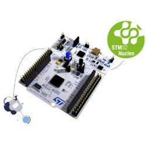
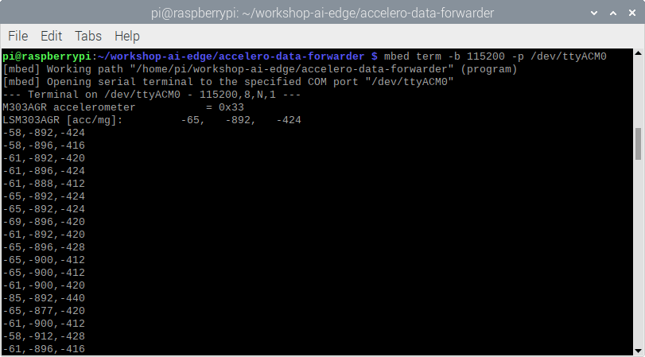

# Run Inference

Training the model is only the first part. This chapter will explain and show how to build an embedded application that can run the trained model. The inference will be demonstrated using two targets. Both targets contain a similar microcontroller but are implemented on very different hardware designs. Using the Mbed rapid device development ecosystem, the firmware is built. The Mbed abstraction libraries enable execution on many other targets with a minimal impact on implementation.

## mbed

[Arm Mbed](https://os.mbed.com/) is a rapid IoT device development platform. Mbed gives a free and open source IoT operating system with connectivity, security, storage, device management and machine learning. It adopts modern software techniques with free development tools with thousands of code examples and support for hundreds of microcontrollers and development boards.

### Mbed OS

Mbed OS provides a well-defined API to develop your C++ application, plus free tools and thousands of code examples, libraries and drivers for common components. With a built-in security stack, core components such as storage, and several connectivity options, you can focus on the code.

More information can be found at [os.mbed.com/docs/mbed-os/latest/introduction](https://os.mbed.com/docs/mbed-os/latest/introduction/index.html). A full list of the API's is available at [os.mbed.com/docs/mbed-os/latest/apis](https://os.mbed.com/docs/mbed-os/latest/apis/index.html)

## Targets

In this example two different development board are targeted. Both targets contain a similar ST ARM Cortex M4 STM32L476 microcontroller but differ in hardware features.

### Nucleo L476RG



The [STM32 Nucleo-64 board](https://www.st.com/en/evaluation-tools/nucleo-l476rg.html) provides an affordable and flexible way for users to try out new concepts and build prototypes by choosing from the various combinations of performance and power consumption features, provided by the STM32 microcontroller. For the compatible boards, the external SMPS significantly reduces power consumption in Run mode.

The ARDUINO® Uno V3 connectivity support and the ST morpho headers allow the easy expansion of the functionality of the STM32 Nucleo open development platform with a wide choice of specialized shields.
The STM32 Nucleo-64 board does not require any separate probe as it integrates the ST-LINK debugger/programmer.
The STM32 Nucleo-64 board comes with the STM32 comprehensive free software libraries and examples available with the STM32Cube MCU Package.

### SensorTile development kit


The [STEVAL-STLKT01V1](https://www.st.com/en/evaluation-tools/steval-stlkt01v1.html) is a comprehensive development kit designed to support and expand the capabilities of the SensorTile and comes with a set of cradle boards enabling hardware scalability.

The development kit simplifies prototyping, evaluation and development of innovative solutions. It is complemented with software, firmware libraries and tools, including a dedicated mobile App.
The SensorTile is a tiny, square-shaped IoT module that packs powerful processing capabilities leveraging an 80 MHz STM32L476JGY microcontroller and Bluetooth low energy connectivity based on BlueNRG-MS network processor as well as a wide spectrum of motion and environmental MEMS sensors, including a digital microphone.
SensorTile can fit snugly in your IoT hub or sensor network node and become the core of your solution.
To upload new firmware onto the SensorTile, an external SWD debugger (not included in the kit) is needed. It is recommended to use ST-LINK/V2-1 found on any STM32 Nucleo-64 development board.

## Application

Now we are ready to run the model on an embedded device. In this case we will run the it on a Cortex-M4 microcontroller from ST. The STM42L476RG is provided on a [NUCLEO L476RG](https://www.st.com/en/evaluation-tools/nucleo-l476rg.html) development board. We can use the included Stlink v2 debugger to flash the device.

The NUCLEO provides Arduino and Morpho compatible headers to make it easy to connect and expand functionality. The microcontroller is a 32bit ARM Cortex M4 with a 80Mhz clock.

You can follow along and find the full code of the project on GitHub: [vives-ai-edge/tensorflow-lite-micro-hello-world-mbed](https://github.com/vives-ai-edge/tensorflow-lite-micro-hello-world-mbed)

### Mbed project setup

In order to get the mbed tool up and running, some configuration must be added to the project. Mbed uses a `mbed_app.json` file for every project that contain custom configuration for that project. For this example to work we need to add some configuration.

Executing tensorflow and allocating the model will need memory on the microcontroller. By default mbed-os allocates some memory to the main thread. In order to have enough free memory on the stack, the main stack size might need to be changed. For this example a value of `65kb` is more than enough.

```json
"config": {
    "main-stack-size": {
        "value": 65536
    }
},
```

The application does not need the whole RTOS runtime. The `bare-metal` runtime provides all the needed resources to run the tensorflow library.

Not having the RTOS available means you need to take care of timings and timers yourself. Luckily mbed provides the `events` library as a separate module. This will enable us to use an `EventQueue` that can take care of timed execution of the application.

The last requirement is the _USB driver_ library that provides USB functionality. This enables us to enumerate a USB Serial device using the USB cable. This is needed for the Sensortile as no UART pins or interface is provided on the small board.

```json
"requires": ["bare-metal", "events", "drivers-usb"]
```

Tensorflow needs some preprocessor directives enabled to compile the application.

```json
"macros": [
    "NDEBUG",
    "TF_LITE_DISABLE_X86_NEON",
    "TF_LITE_STATIC_MEMORY"
],
```

The last thing that needs to be configured for easy debugging are some setting for the UART. The _baudrate_ could be set to 115200 baud.

Mbed does not load the `std` library by default. This is a measure mainly to free up flash and memory for features that might not be used. In our case we want to leverage some features of the standard library for formatted printing like `printf` and be able to print floating point numbers with `printf`.

```json
"target_overrides": {
    "*": {
        "platform.stdio-baud-rate": 115200,
        "target.printf_lib": "std",
        "platform.minimal-printf-enable-floating-point": false,
        "target.device_has_add": [
            "USBDEVICE"
        ]
    }
}
```

With the `mbed_app.json` settings file configured, the compiler and runtime will have the correct information to run the example. Lets take a look at the implementation.

### Model and libraries

The first thing we need to to is to load the correct libraries for mbed and Tensorflow using `#include`.

This is also the time to load the model using the generated `model.h` file. This files contains the `char array` representation of the model.

_Using_ the `tflite` namespace will make the implementation less verbose and easier to read or understand.

An `EventQueue` object is created as well. This will help later when implementing a timer in order to run the inferencing in a repetitive and timed interval.

```cpp
#include "mbed.h"

#include "tensorflow/lite/micro/all_ops_resolver.h"
#include "tensorflow/lite/micro/micro_interpreter.h"

#include "model.h"

using namespace tflite;

EventQueue queue;
```

### USB Serial for Sensortile

The Nucleo L476RG and Sensortile use the same microcontroller, but differ allot in hardware features. The Sensortile lacks the UART to USB converter that is provided on the Nucleo using the ST-Link. In order to be able to communicate with, and get the values of the Sensortile, the USB port can be used.

The default `STD_OUT` for the `printf` needs to be redirected to the USB Serial device. This can be done using the `mbed_override_console()` function.

Now we can use the normal and global `printf` function in our application and communicate over the USB Serial device.

```cpp
//*** Comment next line out if target IS a sensortile ***//
// #define TARGET_SENSORTILE

#ifdef TARGET_SENSORTILE
  #include "USBSerial.h"

  USBSerial serial(false);

  FileHandle *mbed::mbed_override_console(int) {
    return &serial;
  }
#endif
```

### Application constants

The application works by generating a `x` value on every iteration. The `x` must represent value that ranges from 0 to (2 x Pi). So first we need to define Pi and the upper limit value `xrange`. These values where used when training the model.

In order to generate some `x` values, we need to define how many inferences we want in a full cycle. A cycle is includes the full range of 0 to 2 x Pi. In this case we choose to have `100` inferences in a full cycle.

The only thing that last is to count the inferences, so we can keep track on what number for `x` to generate next.

```cpp
const float Pi = 3.14159265359f;
const float xrange = 2.f * Pi;
const int InferencesPerCycle = 100;
int inference_count = 0;
```

### Tensorflow and the model

Now we are ready to load the `model`. The model contains the flatbuffer C data array representation of the generated model.

In order to use Tensorflow Lite Micro, an interpreter is used to convert the model at runtime. The interpreter needs memory to execute, which is defined in the `tensor_arena` array.

In this case a memory arena of 2468 bytes is created, with some extra size. This includes the memory for input, output and intermediate arrays. The size required depends on the model that is used. This may need to be determined by experimentation.

In order to supply and receive values from the model, an input and output `Tensor` object is needed.

The last thing to do is to allocate some memory for that the Tensorflow interpreter can use to do its work.

```cpp
// Structure that contains the generated tensorflow model
const Model* model = GetModel(g_model);

// Interpreter, input and output structures
MicroInterpreter* interpreter = nullptr;
TfLiteTensor* input = nullptr;
TfLiteTensor* output = nullptr;

// Allocate memory for the tensors
const int ModelArenaSize = 2468;
const int ExtraArenaSize = 560 + 16 + 100;
const int TensorArenaSize = ModelArenaSize + ExtraArenaSize;
uint8_t tensor_arena[TensorArenaSize];
```

### Output and feedback

In order to debug, or get feedback of the from the application, two interfaces can be used.

First the led can be used to indicate the current result or `Y` value that is calculated by the model. The Nucleo provides a led that is attached to a PWM output. This enables dimming of the led, depending of a value between `0.0` and `1.0`.

The Sensortile does not provide a led on a PWM output, but only on a GPIO. This means we are not able to dim the led in an efficient way. We can solve this by only turning the led on or off depending of the resulting value.

Other than the visual feedback on a led, more information can be provided using the UART or Serial port. In this case `printf()` is used to nicely format a string. The floating point numbers are converter to a fixed length, and are padded in order to form a constant column width.

```cpp
// Led to indicate the resulted values
PwmOut nucleo_led(LED1);
DigitalOut sensortile_led((PinName)0x6C);


void setLed(float value) {
  nucleo_led = (value + 1) / 2;
  sensortile_led = value < 0.0f ? 0 : 1;
}

void printValues(float x, float y) {
  printf("x_value: % 2.3f, y_value: % 02.3f\n", x, y);
}
```

### Generating the next X value

Per full sine wave cycle, a number of increasing `x` values need te be generated to feed the model input. The `generateNextXValue()` method will generate these number, using the previous state, and will protect against overflow by starting all over again at the end of a cycle.

First, a relative `position` is calculated. This position is then mapped on the full range to calculate the next value for `x`.

Before returning the current value, the `inference_count` is incremented for the next call of the `generateNextXValue()` method. It will account for an overflow and reset the value when needed.

```cpp
float generateNextXValue() {
    float position = (float) inference_count / InferencesPerCycle;
    float x_value =  position * xrange;
    inference_count = (inference_count + 1) % InferencesPerCycle;
    return x_value;
}
```

### Inference implementation

In general, the inference step is pretty easy. Feed the inputs to the first layer of the model, execute the model and fetch the outputs from the last layer. The `inference()` method just implements this behavior.

Following the software _function_ principle, the inputs are given using the methods, arguments, in this case the value of `x`. The method will then execute and run the model once. The result is then returned as the result of the method call.

```cpp
float inference(float x) {
  input->data.f[0] = x;
  interpreter->Invoke();
  return output->data.f[0];
}
```

### Infer a single time

In order to run the inference, the application needs to prepare the inputs and process the outputs. The `run_once()` method will take care of this.

The next value of `x` is generated and passed to the `inference()` method.

The result is then returned and will be stored in a `y_value` variable.

In order to get some feedback of the result, the `y_value` is displayed on the led of the target, and is printed to the UART.

```cpp
void run_once() {
    float x_value = generateNextXValue();

    float y_value = inference(x_value);

    setLed(y_value);
    printValues(x_value, y_value);
}
```

### Bringing it all together

All parts of the application are now ready to be used. The only thing that rests is to integrate them.

An `AllOpsResolver` instance is declared. This will be used by the interpreter to access the operations that are used in the model. This uses a lot of memory. Since a model will only use a subset of operations, it is recommended that real world applications only load the operations that are actually needed.

Now everything is ready in order to create the interpreter. The interpreter will need the model, the operations resolver, the memory area previously allocated for the tensor states, and the size of that memory pool. The last thing to do in order to prepare the interpreter is to allocate the tensors. This will fill the memory of all the layers with the values that are defined in the model.

The input and output instances are then created by calling `input(0)` and `output(0)`. The value of `0` represents the index of the first (and only) tensor. `input` and `output` are globally defined and can be used to reference the input and outputs easily. This might not be the best practice, but will do for this example.

Using the `EventQueue` instance we can trigger the inference to run every `10ms`. The results will be visible with the blinking led and the Serial port.

```cpp
int main(void) {
  static AllOpsResolver resolver;
  static MicroInterpreter static_interpreter(model, 
    resolver, tensor_arena, TensorArenaSize, NULL);
  interpreter = &static_interpreter;
  interpreter->AllocateTensors();

  input = interpreter->input(0);
  output = interpreter->output(0);

  queue.call_every(10ms, run_once);
  queue.dispatch_forever();
}
```

## Building prerequisites

Before compiling the code, we have to check if the mbed-cli commands are available. We can do this by checking the version:

```shell
pi@raspberrypi:~/workshop-ai-edgetensorflow-lite-micro-hello-world-mbed $ mbed --version
```

The version should be **1.10.5** or higher.

The following commands have already been executed by the installation script, but for completion, the following commands should be set to configure the mbed compiler correctly. We are configuring the following:

- Initialise the project by downloading the necessary libraries from their repositories.
- Change the directory to the mbed-os folder.
- Install the required packages using pip.
- Change the directory back to the main project root folder.
- Set the current directory as the project root folder.
- Set the NUCLEO_L476RG as the target microcontroller.
- Set the GCC_ARM toolchain as the compiler. The required version was also installed using the installation script.

The configurations are executed by running the following commands in respective order:

```shell
mbed deploy
cd mbed-os
pip3 install -r requirements.txt
cd ..
mbed config root .
mbed target NUCLEO_L476RG
mbed toolchain GCC_ARM
```

## Building the firmware

Now that these settings are set, we can run the following command to compile the code:

```shell
pi@raspberrypi:~/workshop-ai-edge/tensorflow-lite-micro-hello-world-mbed $ mbed compile
```

**Note: the compile will give some warnings on RaspiOS, e.g. missing packages. This is normal and can be ignored. Some packages are not available for the current version of RaspiOS, but we don't need them for this workshop.**

You should see that the compiler will compile all depending libraries and shows the progress using percentages (0.0% to 100.0%). When finished compiling, and image should be created in the `./BUILD/NUCLEO_L476RG/GCC_ARM`-folder named `tensorflow-lite-micro-hello-world-mbed.bin`. This file has to be transferred to the Sensortile.

## Connecting the hardware

To upload the firmware to the Sensortile edge device, the hardware must be correctly connected to the Raspberry Pi 400 computer. The required parts are an STM Sensortile, a USB micro to USB-A cable for the Sensortile, a NUCLEO_L476RG board, a USB mini to USB-A cable for the NUCLEO and a programming (ribbon) cable to interface between the NUCLEO and Sensortile.

The connections should look as follows:


Additionally, two jumpers on the NUCLEO board should be disconnected. This will allow us to program the Sensortile instead of the microcontroller that is located on the NUCLEO board.


As a last step, the ribbon cable should be connected in the right way. Two arrows will point to PIN 1 of both the SWD connector on the NUCLEO and on the Sensortile. Look closely on how to correctly connect them:


## Flashing the firmware

When everything is connected, turn on the Sensortile (small switch on the side next to the USB connector). If necessary, re-connect the NUCLEO to the Raspberry Pi 400. A pop-up window should notify you that a removable medium has been inserted. You can open the folder or ignore this message. The folder should contain two files: `DETAILS.TXT` and `MBED.HTM`. If this is not the case, check your connections and retry connecting both microcontrollers.

Now we can return back to the mbed-cli terminal where we compiled the firmware. To flash the binary file to the Sensortile, we can re-run the compilation (this will now run much faster because everything is already there), but with the flash argument:

```shell
pi@raspberrypi:~/workshop-ai-edge/accelero-data-forwarder $ mbed compile -f
```

After the compilation output, the command should automatically copy the binary file to the Sensortile and re-connect. The pop-up window with the notification of a removable medium should come up again. Close it.

## Inspecting the serial output

We can now check if the firmware is running correctly on the Sensortile. We can do this by checking the serial output by using a terminal viewer. One could use Putty or TeraTerm on a Windows computer, fortunately the mbed-cli has a terminal viewer built-in! The NUCLEO board will also be connected via a serial port, so to not be confused which port it is, disconnect the NUCLEO device it's USB cable. The serial port can be accessed using the following command:

```shell
pi@raspberrypi:~/workshop-ai-edge/accelero-data-forwarder $ mbed term -b 115200 -p /dev/ttyACM0
```

Note that two arguments were given to the `term`-command:

- `-b 115200`: Configure the baud rate to be 115.200 baud.
- `-p /dev/ttyACM0`: Configure the serial port to read on to be `/dev/ttyACM0`.

**Note: It is possible that your serial port does not correspond with ACM0, but with ACM1 (or other). Hint: type in the command until tty and use the tab-key on your keyboard to give the possible ports to connect to. Complete the command with the possible port (ACM\*).**

The terminal should connect to the Sensortile and give you the following output:



The terminal shows the output of our firmware, namely the accelerometer ID, three accelerometer values in the setup-part of the main function and the accelerometer values at 100 Hz.

Stop the serial port reading by pressing **ctrl-c**.

This concludes the example in which a Tensorflow model is running on a small microcontroller target.
