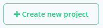
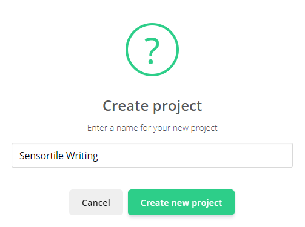
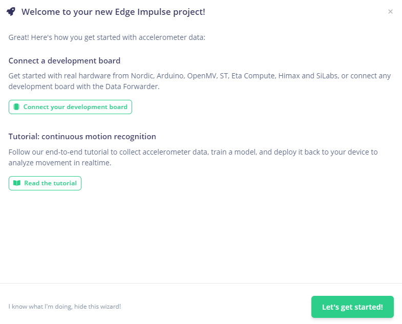

# Creating a Project

Now that you have an account on Edge Impulse, you should land on the "select-project" page.

Create a new project by clicking on the following button:

The application will ask for a name for the project, in this workshop we will use the name **Sensortile Writing**.

By pressing **Enter** or by clicking the **Create new project** button, a notification of a successfull creation should be given. An error could be given if you alread have projects on Edge Impulse and you chose the same name, then please choose a different name.

Now that we successfully created a new project, press **OK** to go to the dashboard page of your project. You will be presented a welcome notification with numerous of possibilities to get started on your new project.

After creating your new project you will enter your project dashboard page with a notification to easily get started with your project.

The goal of this project is to use the accelerometer sensor values to detect which letters or number are being written down. The wizard provides us with an option to select **Accelerometer data**. We will use this option. As you can see, Edge Impulse is not only limited to sensor data, but can also have audio, images or video as data inputs. You can even create your own datasets from any sensor.

Selecting **Accelerometer data** you get two new options:

We can connect a development board using the Data Forwarding tool from Edge Impulse (which we will do!) or we could follow a tutorial in the Documentation of Edge Impulse to analyse movement derived from the accelerometer in realtime.

For now, we will click the **"Let's get started!"** button to manually add our own edge device (Sensortile). For more information on how to add different edge devices, click the **Connecto your development board** button to go to the documentation of Edge Impulse.

In the next chapter we will first inspect and identify the STM hardware and firmware to successfully import data into your project.
