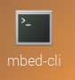
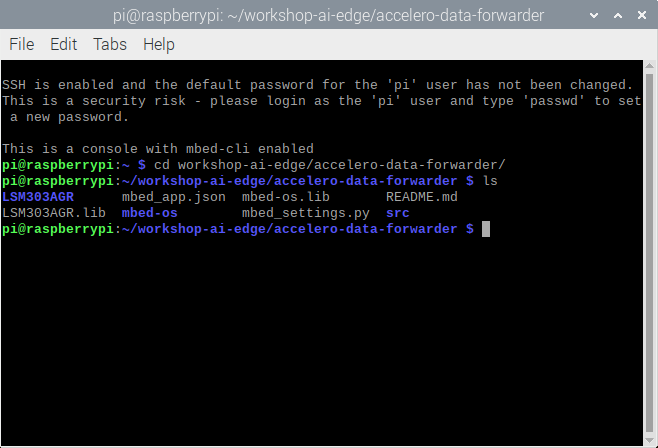
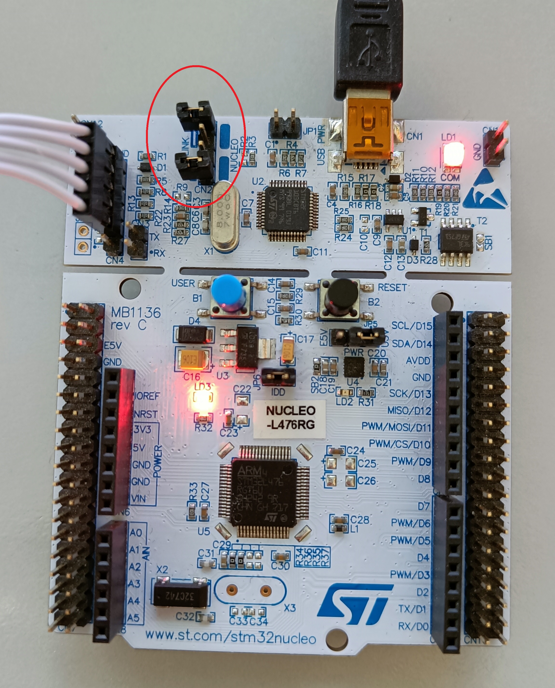
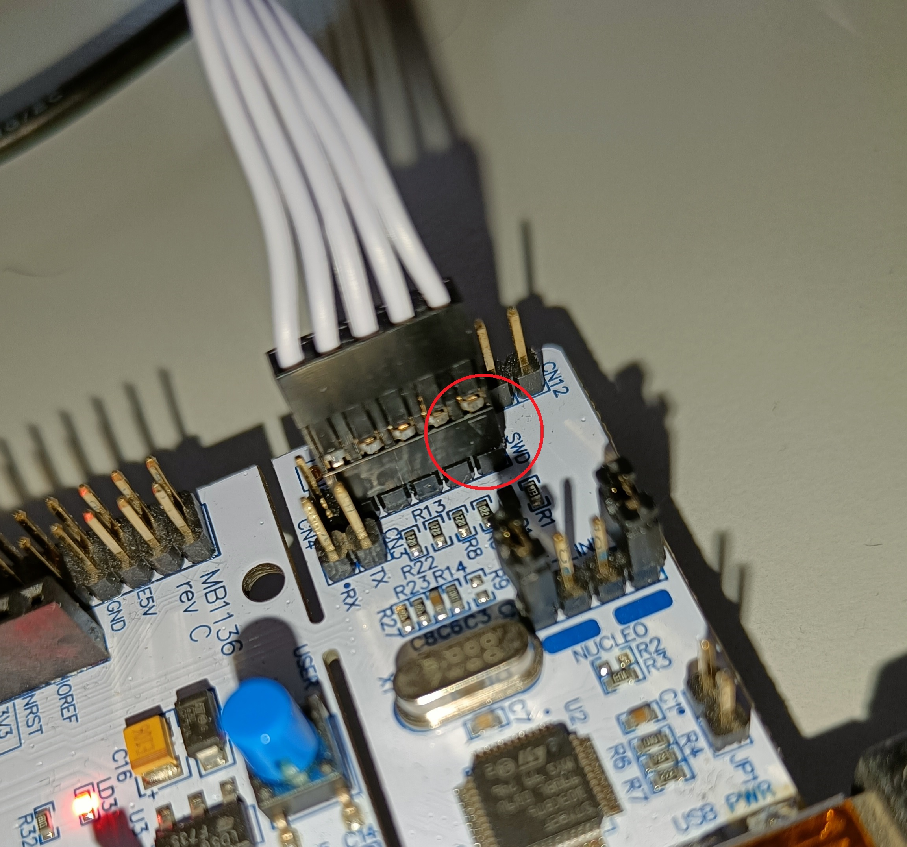
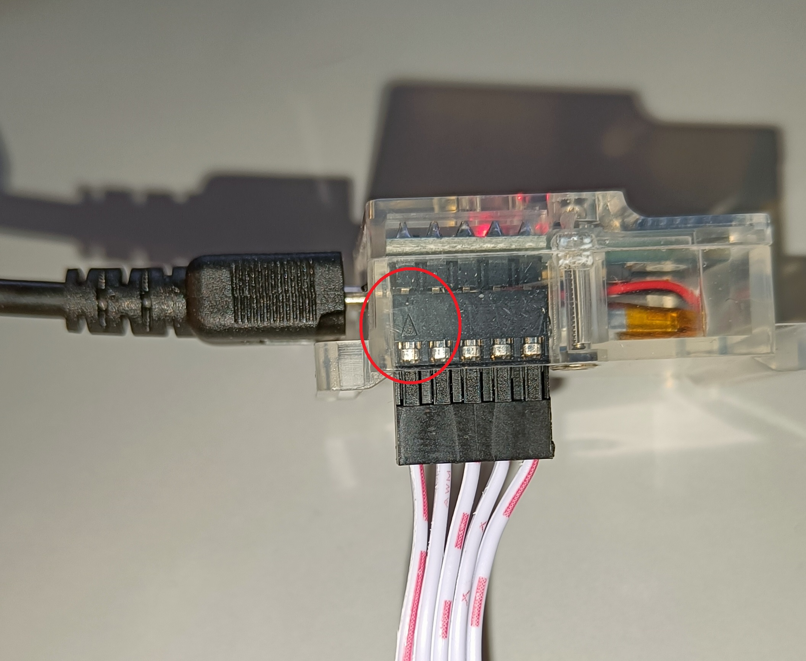
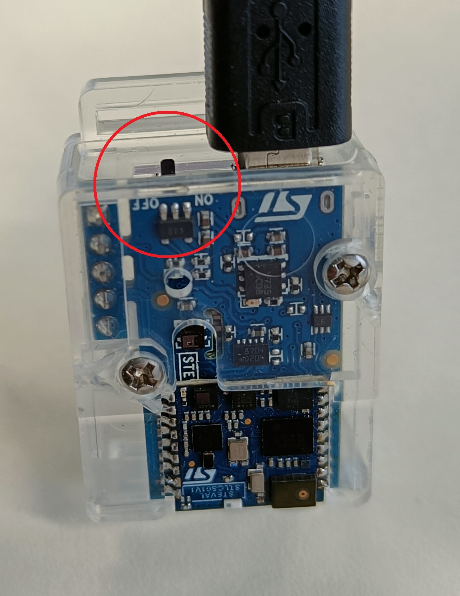

# Inspecting the Firmware

In this project we will let the Sensortile output three-axis accelerometer data (x, y, z) at a rate of 100 Hz. The values will be available on the (virtual) serial port which is provided via the USB connector on the device. The Sensortile contains an STM32L476JGY microcontroller. This microcontroller is compatible with the STM32L476RG microcontroller which is supported by the ARM mbed framework.

## Mbed prerequisites

To be able to compile an mbed project, we can make use of several tools such as the [Mbed Online Compiler](https://os.mbed.com/ide/), the [Mbed Studio](https://os.mbed.com/studio/) or [Mbed CLI1](https://os.mbed.com/docs/mbed-os/v6.15/build-tools/mbed-cli-1.html). The latter will be using throughout this workshop because of it's easy to use command line interface and use on Linux-based systems. Mbed CLI1 and its dependencies have already been installed by the installation script and is available by double-clicking the terminal icon on the desktop name **mbed-cli**.



By double-clicking the icon, a terminal is opened running in a virtual environment with mbed-cli enabled together with its dependencies. This is required to not interfere with the installed packages for running the Jupyter Notebook from Part 1 of this workshop.

## Mbed project files

The required mbed project files to generate the accelerometer data have been automatically installed (the project is cloned from [it's repository](https://github.com/vives-ai-edge/accelero-data-forwarder) by running the installation script). Its location is: `home/pi/workshop-ai-edge/accelero-data-forwarder`. One can go manually into the folder by using the File Manager, or by changing the directory in the terminal to the one of the project:

```shell
pi@raspberrypi:~ $ cd workshop-ai-edge/accelero-data-forwarder
```

**Note: Please run this command and the following inside the mbed-cli terminal and not in the normal terminal application of RaspiOS. In case you are using the normal terminal, activate the virtual environment by sending the following command:**

```shell
source ~/.venv/mbed/bin/activate
```

This will activate the mbed-cli virtual environment and `(mbed)` should now stand in front of you commandline.

When typing in `ls` one can see which files are located in the folder of the accelero-data-forwarder project. Your terminal should show something like this:



The folder contains several folders (in **bold**) and files. A short description of each file or folder is given:

- **LSM303AGR**: Folder with the accelerometer library files.
- mbed_app.json: Mbed configuration file.
- mbed-os.lib: Library file for Mbed OS.
- README.md: Markdown file with the explanation of the repository on Github.
- LSM303AGR.lib: Library file for the accelerometer sensor.
- **mbed-os**: Folder with the Mbed OS libarary files.
- mbed_settings.py: Python file with Mbed OS settings.
- **src**: Folder with the source files (main.cpp)

We are now going to investigate the firmware which will be compiled and put on to the Sensortile Microcontroller. The main code is located in the main.cpp file in the **src**-folder. We can open the file with Geany which is pre-installed on RaspiOS:

```shell
pi@raspberrypi:~/workshop-ai-edge/accelero-data-forwarder $ geany src/main.cpp &
```

:::tip & after command

By placing an `&` after a command, the terminal stays available after running the command. In this way the Geany application can stay open while continuing in the terminal.

:::

## The firmware

The code can be split up into five parts:

- Library imports
- Peripheral definitions
- Functions
- Initialisation or setup code
- Loop code

### Library imports

The Mbed library, a library to allow serial communication over USB and the library to read out the accelerometer are imported in the project.

```cpp
#include "mbed.h"
#include "USBSerial.h"
#include "LSM303AGRAccSensor.h"
```

### Peripheral definitions

We are defining several objects and variables to interface with the USB serial interface, an LED, the accelerometer, which communicates via SPI. The variables are used for timing, saving the sensor ID and the sensor data. The library for the sensor will return three signed integer values which represent the acceleration of the device in the x-, y- and z-direction and specified in milli-G (mg).

```cpp
USBSerial ser;
DigitalOut led((PinName)0x6C);

volatile bool trig = 0;
Ticker timer;
uint8_t id;
int32_t axes[3];

SPI devSPI(PB_15, NC, PB_13);  // 3-wires SPI on SensorTile  
static LSM303AGRAccSensor accelerometer(&devSPI, PC_4);
```

### Functions

Two functions are defined, namely `sample` which is used to trigger an event on a timer interrupt. The event will allow a sensor value to be measured and outputted to the serial interface. The `main` function is the function that will be called when starting the program.

```cpp
void sample(){
    trig=1;
}

int main(void)
{
...
}
```

### Initialisation code

Inside of the main function the setup of the peripherals is defined first. The orange LED on the sensortile will be put on, the accelerometer sensor will be initialised using the specified methods from it's library. The firmware will also output once the ID of the accelerometer and the first accelerometer values for each axis. Finally, a timer is initialised which will call the `sample` function every 10.000 microseconds (us). This means that every 10 ms that function will be called (or we create a trigger that runs at 100 Hz).

```cpp
    led = 1;
    accelerometer.init(NULL);
    accelerometer.enable();
    accelerometer.read_id(&id);
    ser.printf("LSM303AGR accelerometer           = 0x%X\r\n", id); 
    accelerometer.get_x_axes(axes);
    ser.printf("LSM303AGR [acc/mg]:      %6ld, %6ld, %6ld\r\n", axes[0], axes[1], axes[2]);
    timer.attach_us(&sample,10000);
```

### Loop code

Finally, this part of code will run indefinitely. It will wait untill the timer triggers the `sample`function which will allow the code to get accelerometer values. The values are immediately send out to the USB serial port. The LED is toggled so that it will flash for every other accelerometer sample.

```cpp
    while(true){
        while (!trig){}
        trig = 0;
        accelerometer.get_x_axes(axes); // because axis has size 3, it will get x, y and z
        ser.printf("%ld,%ld,%ld\n\r",axes[0],axes[1],axes[2]);
        led = !led;
    }
```

To go back to the terminal, close Geany.

## Compiling the code

Before compiling the code, we have to check if the mbed-cli commands are available. We can do this by checking the version:

```shell
pi@raspberrypi:~/workshop-ai-edge/accelero-data-forwarder $ mbed --version
```

The version should be **1.10.5** or higher.

:::tip Updating mbed-os and installing its requirements

The following commands have already been executed by the installation script, but for completion, the following commands should be set to configure the mbed compiler correctly. We are configuring the following:

- Initialise the project by downloading the necessary libraries from their repositories.
- Change the directory to the mbed-os folder.
- Install the required packages using pip.
- Change the directory back to the main project root folder.
- Set the current directory as the project root folder.
- Set the NUCLEO_L476RG as the target microcontroller.
- Set the GCC_ARM toolchain as the compiler. The required version was also installed using the installation script.

The configurations are executed by running the following commands in respective order:

```shell
mbed deploy
cd mbed-os
pip3 install -r requirements.txt # this can give errors on RPi, we can ignore them
cd ..
mbed config root .
mbed target NUCLEO_L476RG
mbed toolchain GCC_ARM
```

:::

When mbed-os is updated, the requirements are installed and the root folder, target and toolchain are configured correctly, we can run the following command to compile the code:

```shell
pi@raspberrypi:~/workshop-ai-edge/accelero-data-forwarder $ mbed compile
```

**Note: compiling the code will give some warnings on Raspberry Pi OS, e.g. missing packages. This is normal and can be ignored. Some packages are not available for the current version of the operating system, but we don't need them for this workshop.**

You should see that the compiler will compile all depending libraries and shows the progress using percentages (0.0% to 100.0%). When finished compiling, an image should be created in the `./BUILD/NUCLEO_L476RG/GCC_ARM`-folder named `accelero-data-forwarder.bin`. This file has to be transferred to the Sensortile.

## Connecting the hardware

To upload the firmware to the Sensortile edge device, the hardware must be correctly connected to the Raspberry Pi 400 computer. The required parts are an STM Sensortile, a USB micro to USB-A cable for the Sensortile, a NUCLEO_L476RG board, a USB mini to USB-A cable for the NUCLEO and a programming (ribbon) cable to interface between the NUCLEO and Sensortile.

The connections should look as follows:


Additionally, two jumpers on the NUCLEO board should be disconnected. This will allow us to program the Sensortile instead of the microcontroller that is located on the NUCLEO board.



As a last step, the ribbon cable should be connected in the right way. Two arrows will point to PIN 1 of both the SWD connector on the NUCLEO and on the Sensortile. Look closely on how to correctly connect them:



## Flashing the firmware

When everything is connected, turn on the Sensortile (small switch on the side next to the USB connector).



If necessary, re-connect the NUCLEO to the Raspberry Pi 400. A pop-up window should notify you that a removable medium has been inserted. You can open the folder or ignore this message. The folder should contain two files: DETAILS.TXT and MBED.HTM. If this is not the case, check your connections and retry connecting both microcontrollers.

Now we can return back to the mbed-cli terminal where we compiled the firmware. To flash the binary file to the Sensortile, we can re-run the compilation (this will now run much faster because everything is already there), but with the flash argument:

```shell
pi@raspberrypi:~/workshop-ai-edge/accelero-data-forwarder $ mbed compile -f
```

After the compilation output, the command should automatically copy the binary file to the Sensortile and re-connect. The pop-up window with the notification of a removable medium should come up again. Close it.

While flashing the Sensortile, the LED on the NUCLEO board should flash between green and red.

:::tip Flashing failed

If flashing the target didn't work in this way, try re-connecting the NUCLEO and Sensortile. First connect the Sensortile correctly to the NUCLEO board and lastly plug in the NUCLEO board into the computer. If this still didn't work, try copy-pasting the binary which is located in the `./BUILD/NUCLEO_L476RG/GCC_ARM`-folder named `accelero-data-forwarder.bin` to the Sensortile removable medium.

:::

## Checking the firmware

We can now check if the firmware is running correctly on the Sensortile. We can do this by checking the serial output by using a terminal viewer. One could use Putty or TeraTerm on a Windows computer, fortunatly the mbed-cli has a terminal viewer built-in! The NUCLEO board will also be connected via a serial port, so to not be confused which port it is, disconnect the NUCLEO device it's USB cable. The serial port can be accessed using the following command:

```shell
pi@raspberrypi:~/workshop-ai-edge/accelero-data-forwarder $ mbed term -b 115200 -p /dev/ttyACM0
```

Note that two arguments were given to the `term`-command:

- -b 115200: Configure the baud rate to be 115.200 baud.
- -p /dev/ttyACM0: Configure the serial port to read on to be /dev/ttyACM0.

**Note: It is possible that your serial port does not correspond with ACM0, but with ACM1 (or other). Hint: type in the command until tty and use the tab-key on your keyboard to give the possible ports to connect to. Complete the command with the possible port (ACM\*).**

The terminal should connect to the Sensortile and give you the following output:


The terminal shows the output of our firmware, namely the accelerometer ID, three accelerometer values in the setup-part of the main function and the accelerometer values at 100 Hz.

Stop the serial port reading by pressing **ctrl-c**.

We are now ready to connect to Edge Impulse and forward the accelerometer values to our project.
