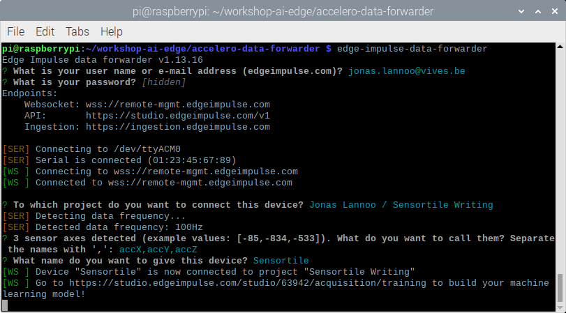

# Connecting a Device

The Sensortile exports x, y and z accelerometer data through its USB serial port. We can now use this to connect to the Edge Impulse project.

## Edge Impulse Data Forwarder

Edge Impulse provides the [Edge Impulse CLI](https://docs.edgeimpulse.com/docs/cli-installation) which contains JavaScript packages for communicating with your devices. It can be installed using `npm`. The CLI is already installed together with its dependencies using the installation script.

Open a new terminal, or keep using the one that was used for compiling and flashing the Sensortile data forwarding firmware.

To start up the data forwarding process, type in:

```shell
edge-impulse-data-forwarder
```

and press **Enter**. When running this command for the first time, it will ask for your username and password from Edge Impulse.

Next, it will find the serial device to connect to. If you have both the Sensortile and NUCLEO board plugged in, please select the Sensortile serial port. Select the Edge Impulse project it has to link the device to. The data forwarder should detect the data frequency, it should be 100 Hz. It will also detect the format of the data which we are sending. The format is three unsigned integers and we have to give them a name. In this example they are called **accX,accY,accZ** but you could give them another name. Lastly, the device has to be given a name, "Sensortile" in this case. A summary of the configuration should look like this:



**Note: if the detected frequency is not what you configured, retry or force the frequency by adding "-f 100" after the edge-impulse-data-forwarder.**

Now we need to confirm that the device has correctly been connected with our Edge Impulse project.

## Edge Impulse devices

Go back to the browser where the dashboard of your Edge Impulse project is located. On the left-hand-side we can browse to the **Devices** page.

There your Sensortile device with all it's parameters should show up like follows:


The summary should show your device its Name, ID, connection type, sensor type, remotely availability and when it has seen it for the last time.

Succes!

Next we can use the sensortile and the data forwarder to capture and import data in Edge Impulse.
