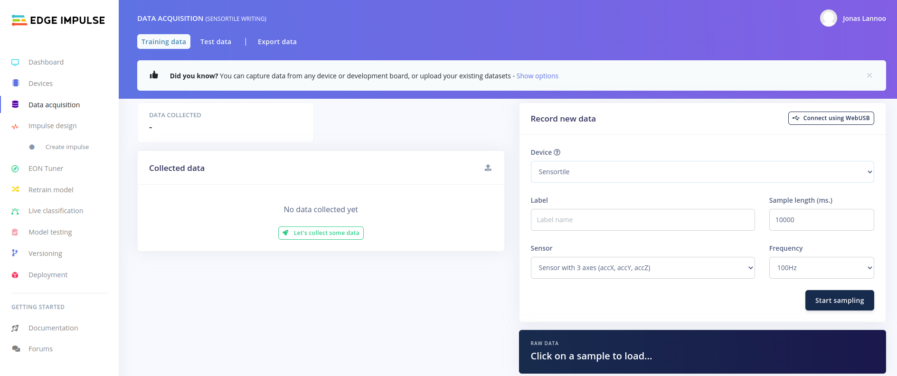
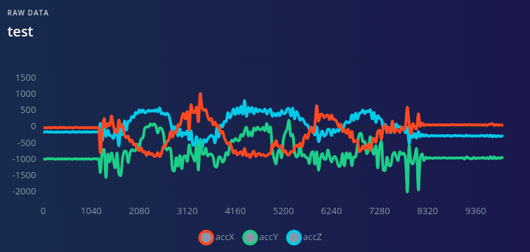
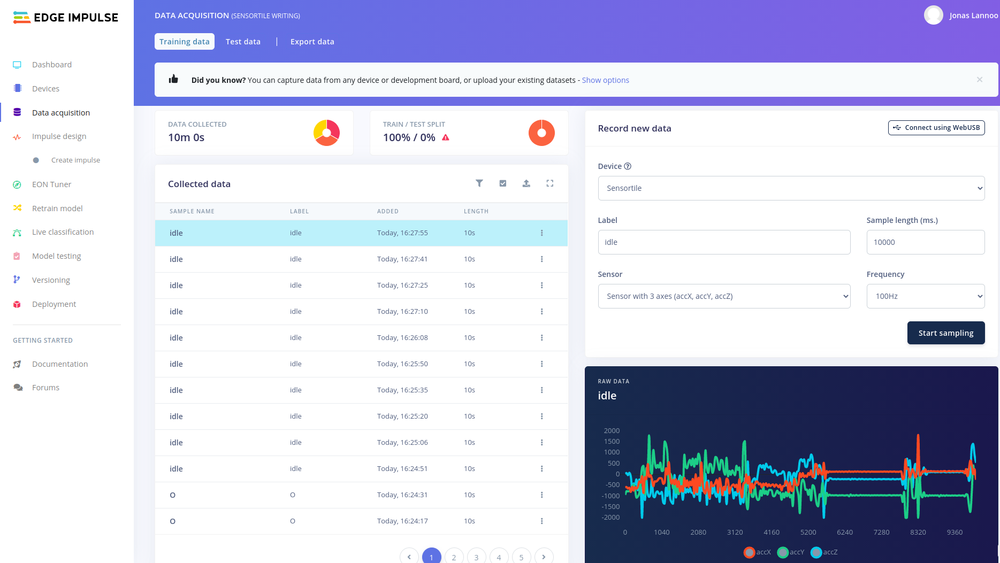
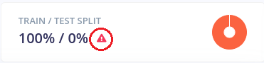
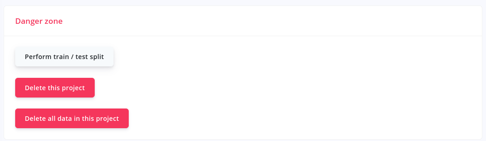
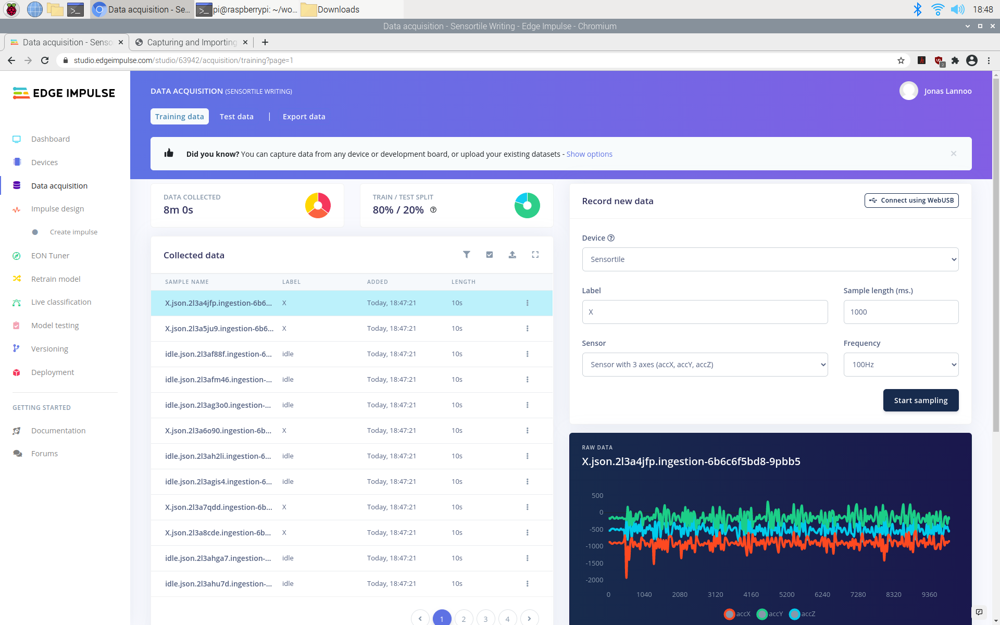

# Capturing and Importing Data

Using the data forwarder (which is running) and the Edge Impulse framework we can capture data into our project.

## Collecting your first dataset

We now browse to **Data acquisition** in Edge Impulse to collect data. It should look something like this:

Before capturing the true dataset, let us first get used to the capturing environment. On the right-hand-side we can see the **Record new data** zone. Here we first select our device (the Sensortile). We then need to give the data which we are going to collect a label. When capturing the actual data for this project, this will be the letter or number that has been written and that has to be detected (for example A or B, X or O). For now, we are going to do a test-run, so we are calling this "test". The sample length is configured to 10.000ms (equal to 10 seconds), we are going to keep this value. The sensor which we want to use is the accelerometer and the configured frequency was detected by the data forwarder, 100 Hz.

To start collecting data, press the **Start sampling** button. After waiting for a few milliseconds, the button should change to a count-down counter as shown in the image below. Try to move the sensortile in the meanwhile. After 10 seconds, your accelerometer values should be shown.

**Note: if the data capturing system gives an error when recording new data, restart the edge-impulse-data-forwarder and power-cycle the Sensortile.** The edge-impulse-data-forwarder can be reset by adding --clean after it.

The testing data can be static or moving depending on what you do with the Sensortile:

Try recording a few sets of test-data and try start writing some letters or numbers on a piece of paper while recording. To mount the Sensortile in the pen-holder (cradle), use the following steps in the figure. The sensortile should fit snugly.

If you are comfortable with writing letters within the timeframe and the data looks as expected, you can go over to the next step. **Please remove all the test-data from the collection so you can start from fresh.**

## Collecting the actual data

To collect and record the actual data for training the neural network we need to define the labels for our data and need a data capturing plan.

The labels that are chosen in this example are:

- X: Write the letter 'X'
- O: Write the letter 'O'
- idle: Not writing a letter, holding pen in hand or laying on the desk.

The capturing plan goes as follows:

1. Capture 20x 10 seconds of writing the letter X continuously (with very short pauses in between <500 ms).
2. Capture 20x 10 seconds of writing the letter O continuously (with very short pauses in between <500 ms).
3. Capture 20x 10 seconds of idle by putting the pen in several positions on the desk, holding it in hand still for a few seconds, move around without writing anything down.

After collecting the data, your Edge Impulse project should look like this:

A total of 10 minutes of data has been collected. The **TRAIN / TEST SPLIT** window shows an error by showing a small red warning sign. This means that there is no test data available yet. This will be solved shortly.

Two options are possible now:

1. We can use the data as-is. (blocks of 10 seconds)
2. We can manually split the data to only save the captured parts where you were actually writing letters or numbers.

:::tip Note

In this example we will go forward by choosing option **1**. Choosing option two requires some pre-processing and you have to decide yourself when you started writing and stopped writing. Another solution to do this is to only record the writing of a single letter. These options could result in better detection performance, but require more time. In the workshop we will not do this to save time.

:::

## Splitting in Training and Test dataset

In order to validate the training of the future neural network, the dataset has to be split up in a part to **train**, and a part to **test** the resulting network. Instead of doing this manually we can let Edge Impulse do this for you.

:::tip Splitting in Data Acquisition

The data can also be split by pressing the red warning sign next to the **TRAIN / TEST SPLIT** window in Data Acquisition.

:::

Browse to the **Dashboard page** of your Edge Impulse project and scroll down to the bottom of the page.

There you should find a red **Danger zone** with buttons that can have a huge effect on your project functionality and end-result. Press the **Perform train / test split** button to split up our currently collected dataset. Edge Impulse will ask for a confirmation and explicitly type "perform split" to perform the split.

Going back to the **Data acquisition** board should show us the same dataset, but now the warning at the **TRAIN / TEST SPLIT** should have dissapeared. The pie-chart and the percentages should show that the data has been split up with a 80/20 ratio, train and test part respectively.

Now the data collection is ready and you can advance to creating features out of the data, creating a neural network and training it. In Edge Impulse this is equal to an impulse design.

:::tip Data export and import

Edge Impulse allows you to export the data you have collected with it's tools and import previously collected and exported data. **Exporting** can be done by using the "Export data" option at the top of main dashboard page or the data acquisition window. Several export types are available. **Importing** data can be done as well by pressing the "drive with and arrow (pointing up)"-button which is located on the right side of your collected data. Again several formats are available. More information and other methods are available in the [Edge Impulse documentation](https://docs.edgeimpulse.com/reference/ingestion-api).

:::
