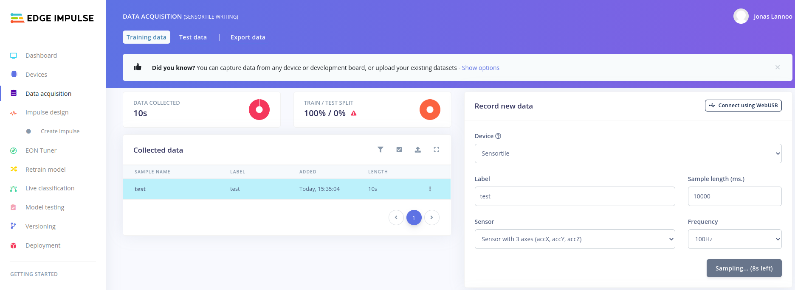

# Capturing and Importing Data

Using the data forwarder (which is running) and the Edge Impulse framework we can capture data into our project.

## Collecting your first dataset

We now browse to **Data acquisition** in Edge Impulse to collect data. It should look something like this:

Before capturing the true dataset, let us first get used to the capturing environment. On the right-hand-side we can see the **Record new data** zone. Here we first select our device (the Sensortile). We then need to give the data which we are going to collect a label. When capturing the actual data for this project, this will be the letter or number that has been written and that has to be detected (for example A or B, X or O). For now, we are going to do a test-run, so we are calling this "test". The sample length is configured to 10.000ms (equal to 10 seconds), we are going to keep this value. The sensor which we want to use is the accelerometer and the configured frequency was detected by the data forwarder, 100 Hz.

To start collecting data, press the **Start sampling** button. After waiting for a few milliseconds, the button should change to a count-down counter as shown in the image below. Try to move the sensortile in the meanwhile. After 10 seconds, your accelerometer values should be shown.

**Note: if the data capturing system gives an error when recording new data, restart the edge-impulse-data-forwarder and power-cycle the Sensortile.** The edge-impulse-data-forwarder can be reset by adding --clean after it.

The testing data can be static or moving depending on what you do with the Sensortile:

Try recording a few sets of test-data and try start writing some letters or numbers on a piece of paper while recording. To mount the Sensortile in the pen-holder (cradle), use the following steps in the figure. The sensortile should be fit snugly.

If you are comfortable with writing letters within the timeframe and the data looks as expected, you can go over to the next step. **Please remove all the test-data from the collection so you can start from fresh.**

## Collecting the actual data

In this
