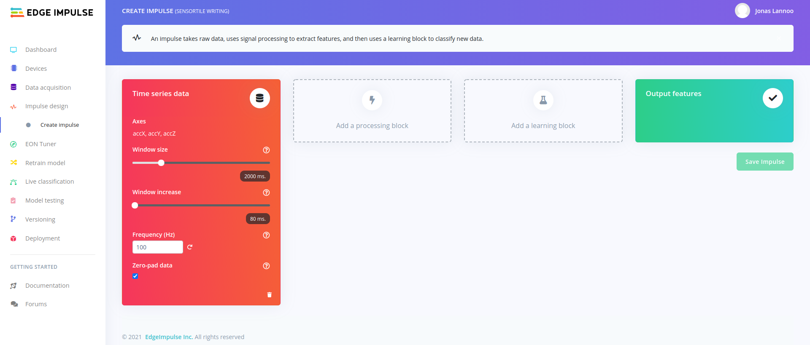
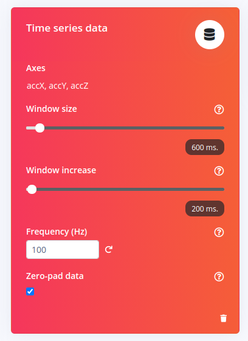
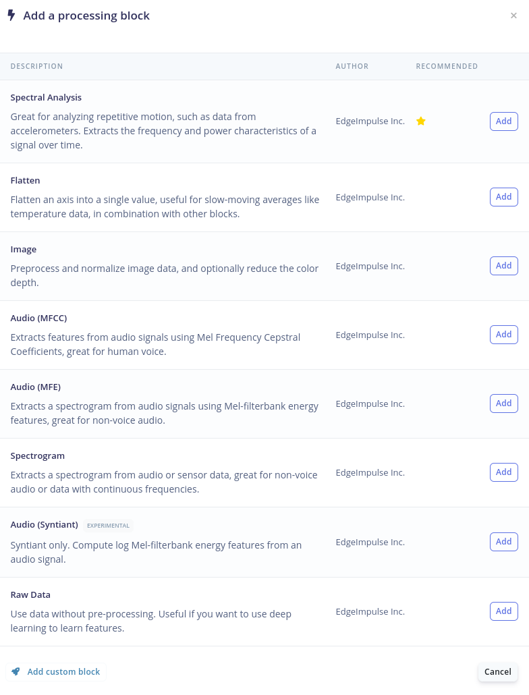
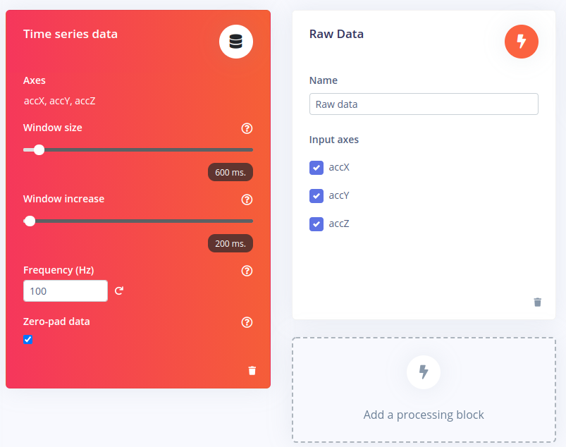
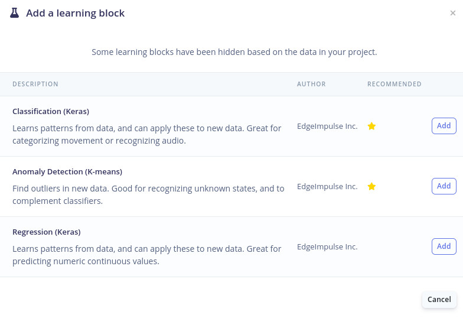
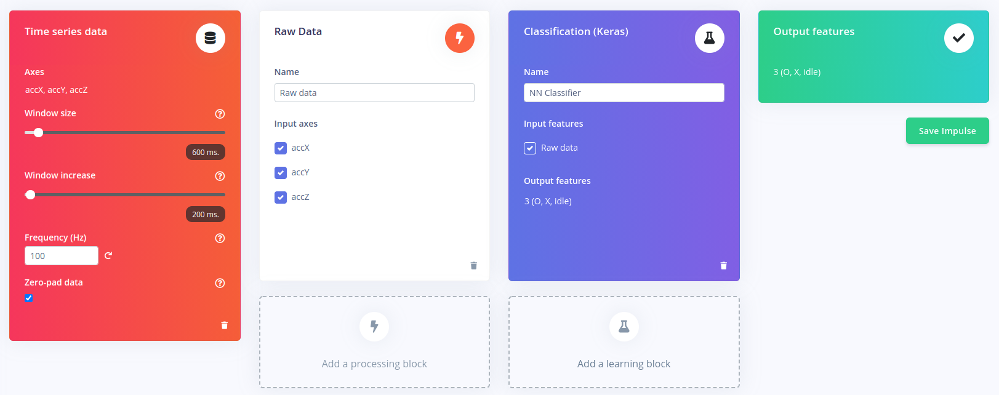
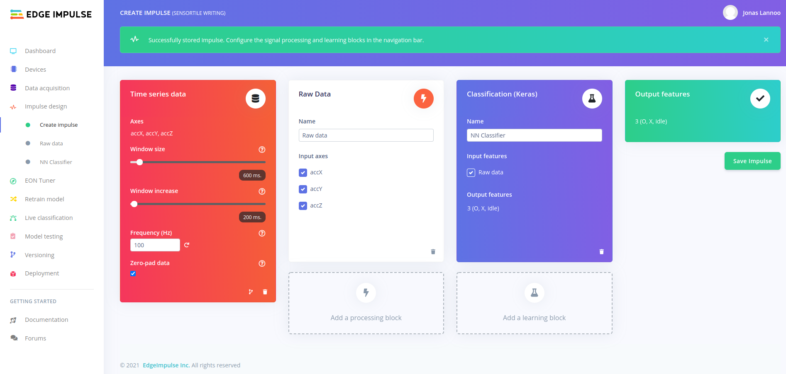

# Creating an Impulse

After acquiring data for our project, we have to do something with it. In the Edge Impulse framework, a workflow is defined as an impulse design. The design is configured to take your data, apply signal processing, extract features and learn and classify the data.

To create an impulse, go to the **Impulse design** board. An empty impulse should look like this:

An impulse consists out of four main parts. First, your data is interpreted by the "red box". In our case this is **time series data** because we recorded values in function of time. Would you import or capture images, this block will change to an image interpreter. When looking closer, we can see our three defined axis of acceleration, a configured **Window size**, **Window increase**, **Frequency (Hz)** and **Zero-pad data**. These last four are more explained in detail:

- Window size: Edge Impulse will automatically split up your data in several windows. This window is defined as the starting time + the window size. When choosing the same time as the capture settings, only one window will be created. This is also the size of the data that will be processed per classification, in milliseconds.
- Window increase: The window increase will define the difference in time between consecutive windows. This will not be the time between windows, but the difference in starting time of windows. If this is equal to the window size, there will be no overlap of the windows. If this is smaller, the system will create multiple overlapping windows. This is also known as a sliding window.
- Frequency (Hz): The frequency fines the delta-time between data values (samples). This value was derived from the data acquisition step. When changing this the data will be down- or upsampled.
- Zero-pad data: If the window size is larger than the actual captured data, the window will be padded with zeros. If this option is unchecked, shorter windows will not be used for classification.

For our project we will change the window size to a value that matches the time required to write a single letter or number. This could of course depend on the writing speed of the user. In this example we choose a size of 600 ms, but this could also be more. This can be changed later the change the performance of the model. We will also change the window increase to 100 ms to use multiple overlapping windows per collected data frame.

Second, a processing block has to be added to the impulse design. The processing block has many possibilities and allows the user to perform several different signal processing functions to the windows (that have been derived from the dataset). When clicking on **add a processing block**, a list with options becomes available. For example, **Spectral Analysis** will allow the user to extract features using the frequency domain of the data. Each processing function has a short description. It is up to the user to choose the best option for the type of data that has been imported. In the case of this project we will choose **Raw** as we want to use deep learning to train our model. This means that no pre-processing step is required to use our data for classification.

Edge Impulse will recommend specific blocks by adding a yellow star to it. When you are not sure which processing block to use it is a good choice to go with the recommended one.

After selecting the **Raw Data** block the impulse design should look like this:

The three axis that were defined during the data acquisition correspond with the three input axes for the processing block.

Next up we need to add a learning block. For this project the **Classification (Keras)** learning block is chosen as we want to classify the extracted features from the data into the labels we have initially given them during data acquisition. Again recommendations are given by Edge Impulse by the yellow stars.

After selecting the learning block, the classification block should show **Raw data** as its input features. These are the features that comes out of the previously defined processing block. The output features will be the labels defined in the data acquisition step.

As you can see, multiple processing and learning blocks can be added in addition to those that have been defined in previous steps. By doing so, one can use multiple signal processing functions on the same data to extract even more features out of a single dataset. Also different learning blocks can be defined to for example to detect anomalies in the input data and discard them from the training dataset.

Finally, by pressing the **Save Impulse** button, the design flow should be saved and a green bar with **Succes!** should pop up on the top of the page. This means we can now continue to go more into the detail of feature generation and classification of the data.
