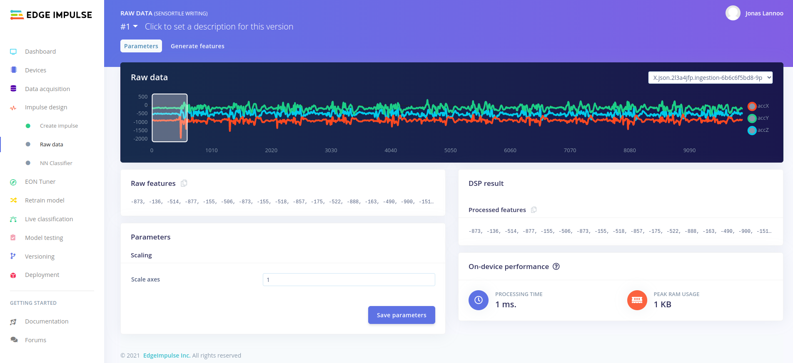
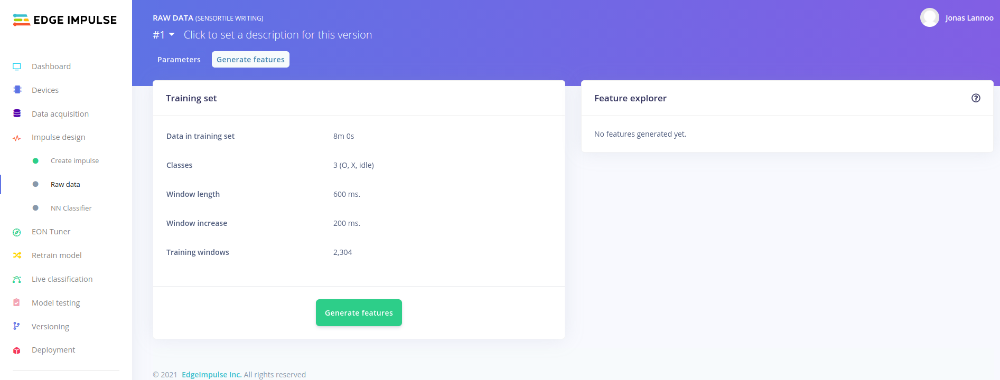
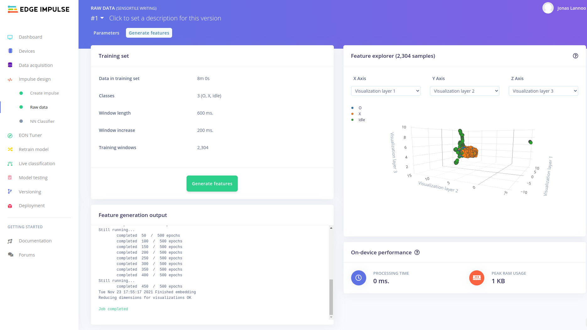

# Feature Generation

The impulse design we created in the previous step contains one or more processing blocks. A processing block in general can be configured to extract features from the data we have collected. The *Raw* processing block we selected doesn't allow us to change much to the features that are extracted from the data. In fact, the window itself will be the features that are going to be processed. The only option we have is to **scale** the raw accelerometer values. In this case we are going to keep the scaling value to "1". Edge Impulse gives us two feature previews, the raw features and the processed features. In our case, these are the same because we are not performing any digital signal processing (DSP) operations on them and the scaling factor stays one.

Other example: When one would select the **Flatten** processing block, these processed features would be for example: mean, minimum, maximum, kurtosis, etc.

Edge Impulse will also give us an estimation of the on-device performance (processing time and peak RAM usage) for calculating the features from the raw data.

When the processing block parameters are set, we have to save it to go to the next step.

:::tip Performance estimation

The **On-device performance** is an estimation based on the selected device used for your project. You can configure for which device the estimation has to be calculated for. Go to the main **Dashboard** of your project and find **Project info** on the right hand side. There you can change your device to adjust the latency calculations.

:::

The previous step showed a preview of the processed features according to the block parameters you have configured. By saving these parameters we automatically go to the next step where the features are calculated for all the data (in our case time domain windows). Edge impulse shows a summary of the training set and its settings. To generate all the features, press the **Generate features**-button.

Edge Impulse will calculate those features by starting a job on their available cloud servers. The process of calculating the features can be followed in the **Feature generation output**. When the feature calculation is done (this can take some time depending on the size of you dataset and the number of features requested), the **Feature explorer** will show you a 3D visualisation of the processed windows. Each axis represents a feature extracted from the data. Each point in the pointcloud is classified and colored according to its label.

The pointcloud in the feature explorer already gives us an idea on how good our neural network will be able to separate the different labels from the others. The more spaced out they are, the better the network results may be.

The second part of the impulse design was setting the learning block. This block will be configured in the next chapter.

