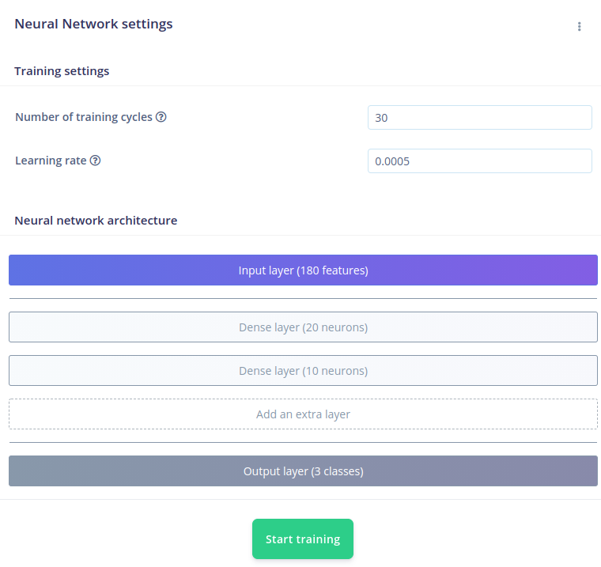
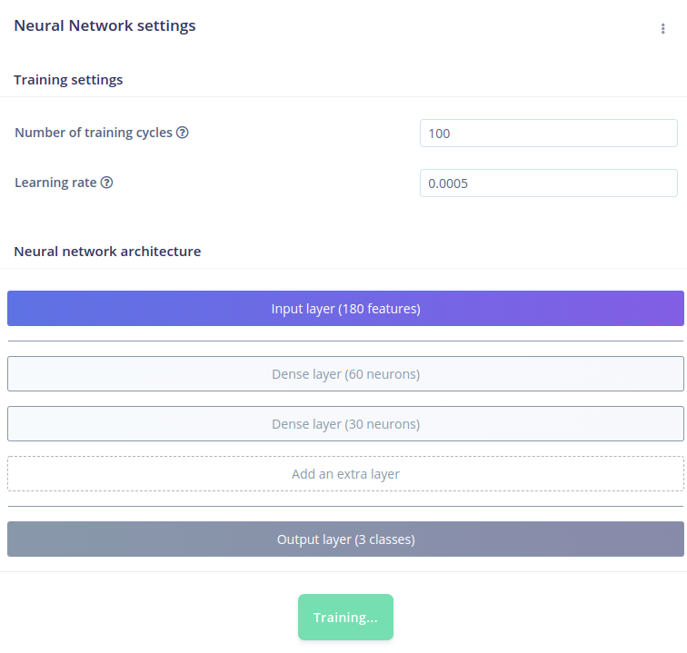
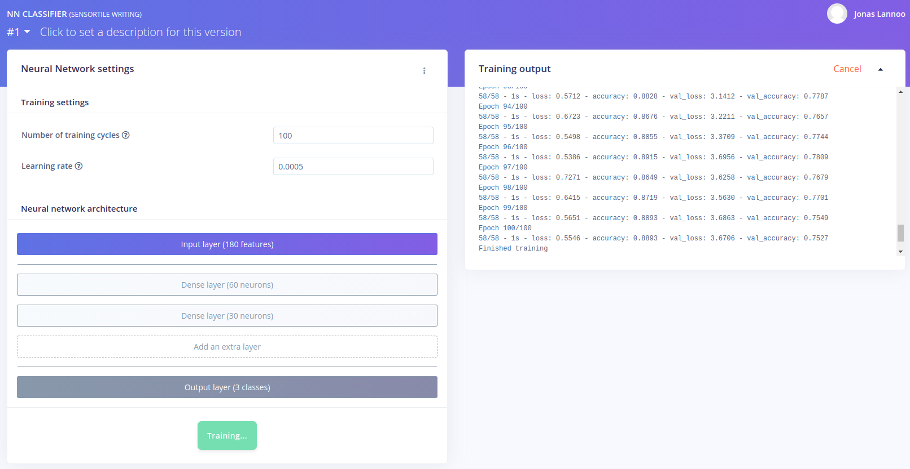
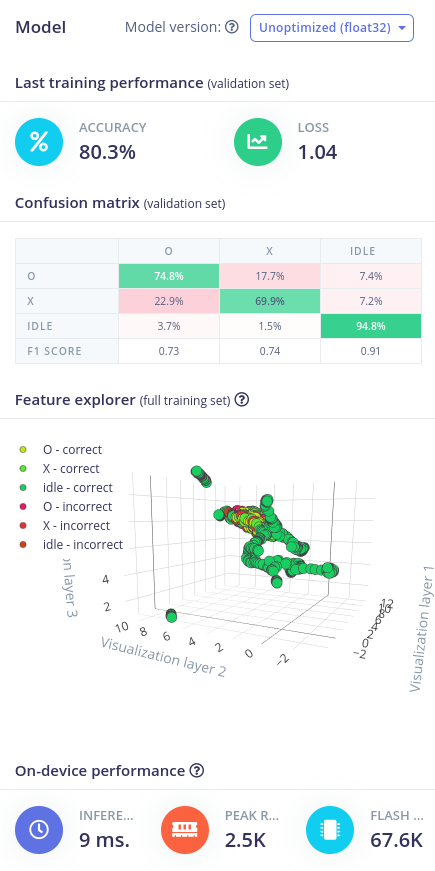
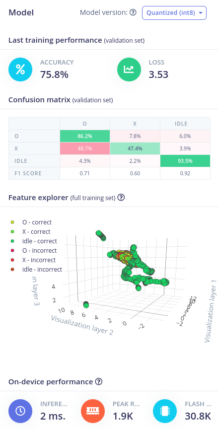

# NN Training

The learning block of the impulse design was configured as a Keras Classification block. In this block we have to configure the settings of a Neural Network (NN) and train the NN.

## NN settings

The neural network has several training settings and an architecture that can be configured. The training settings consist of a number of training cycles and a learning rate. The **Number of training cycles** means how much **epochs** a neural network has to be trained. An **epoch** is an instant in time chosen when something new starts, in the case of training a neural network an epoch denotes the start of a new training cycle. It could also be defined as "one pass over the entire dataset". The **Learning rate** will configure how fast the neural network learns. The learning rate is a factor that decides how big or small the update of a node its weight will be. If the network overfits quickly, then lower the learning rate. The default number of training cycles configured in Edge Impulse is 30, and the default learning rate is 0.0005.

Because we have a quite small data set we are going to change the number of training cycles to 100. The learning rate we will leave as-is.

:::tip Hyperparameters

The number of epochs and learning rate are a part of the hyperparameters of a neural network. You don't have to follow the numbers of this workshop and can change them to achieve better (or worse) training results.

:::

## NN architecture

Next in the NN settings is the NN architecture where we configure the layout of the AI model. As in the introduction and "hello world"-example, we have to configure inputs, outputs and some layers in between. In this case our number of inputs is configured by the feature generation step. We can see that the number of inputs is **180** features. How do we get this number?

- One window was configured as 600 ms.
- Our sampling frequency is 100 Hz.
- This would mean 60 samples per window.
- We have three axes with inputs (accX, accY and accZ).
- We are performing no special feature extraction, the signal processing block its output is the raw data.
- 60 samples x 3 axes = 180 features

The number of output classes is fixed to **3** and are the three labels we configured during data acquisition.

The layers in between are pre-configured and the default is two dense (or fully connected) layers with 20 and 10 neurons (or nodes) respectively. We can train the network with these settings, but it would underperform. In this example we change the number of neurons to 60 and 30 respectively. This can be done by hovering over the layer and clicking the "edit" button (with pencil).

:::tip Dense/FC layer

A dense or Fully Connected layer is a layer of nodes where all the inputs are connected to all the nodes and all the nodes will be connected with the next layer. So every node can be influenced by all the inputs.

:::

If desired, one can remove or add extra layers to the network architecture. Different types of layers are possible but are not discussed further in this workshop. More details about the layers used in Edge Impulse and all other configurable layers can be found in the [Keras Layers API](https://keras.io/api/layers/).

## NN training

All configurations are set to start training the network. When pressing **Start training**, the settings and parameters are sent towards a training node of the Edge Impulse cloud servers. In the **Training output** window you can follow the progress of your job. You will see the number of epochs passing by and see the evolution of the accuracy and loss values. The definitions of these parameters is:

- loss: The value that a neural network is trying to minimize. It's the distance between the ground truth and the predictions. In order to minimize this value or distance, the neural network learns by adjusting weighs and biases so that it reduces the loss.
- accuracy: The percentage of instances that are correctly classified. In our cases this denotes how many windows were correctly classified.
- val_loss: The loss for the testing or validation dataset.
- val_accuracy: The accuracy for the testing or validation dataset.

When the training is done, a summary is given of the training results. They are discussed in the next section.

## NN results

## Next steps

Now that we have a trained network, we can classify new real-world inputs and see how well our neural network performs! Please go over to the next chapter where we start with live classification of new data.

