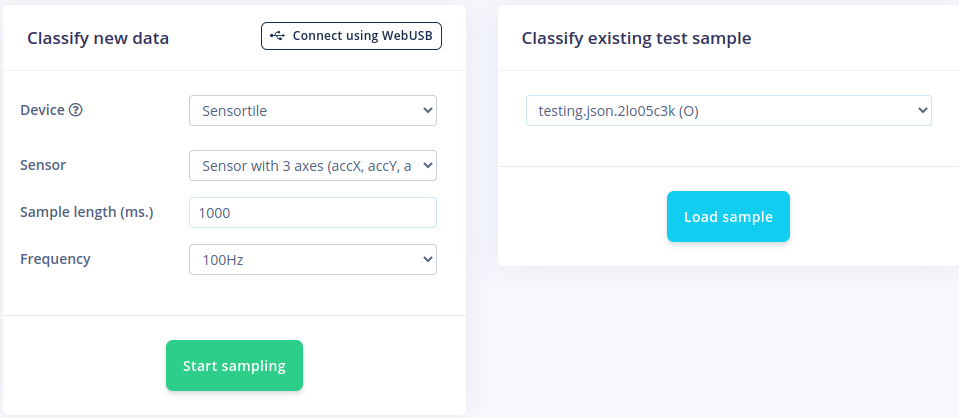
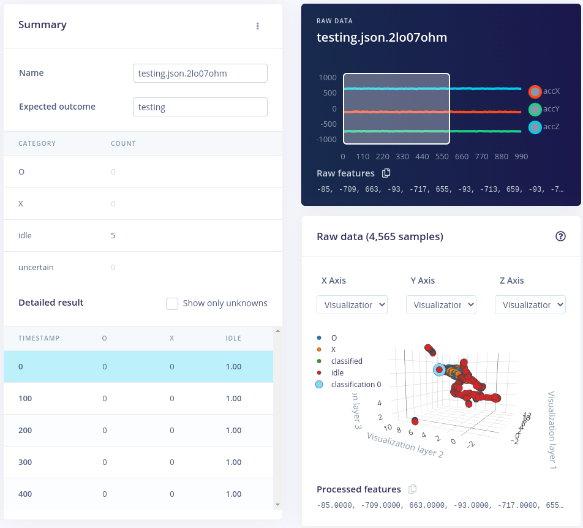
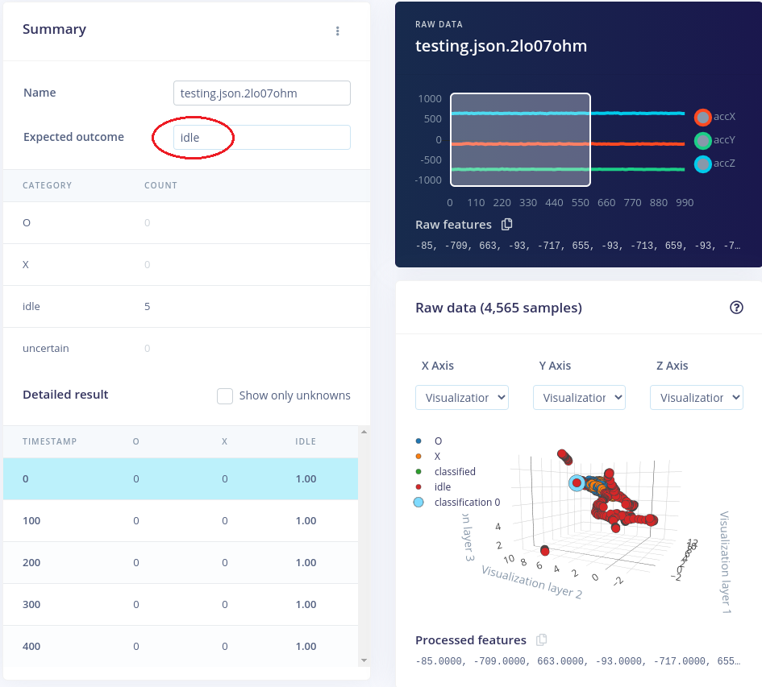

# Live Classification

After completing the training step and having a neural network that is of sufficient performance, we can test it out on our device itself. Edge Impulse allows us to test new data directly by importing it via the previously used *edge-impulse-data-forwarder*-tool to import data into our project.

:::warning No devices connected

If no device is recognized in the Live classification step, please turn on and re-connect the Sensortile to the computer. Open a terminal, run the `edge-impulse-data-forwarder` script and connect to the project using your credentials. If necessary, re-compile and flash the *accelero-data-forwarder* code back to Sensortile.

:::

When the Sensortile is connected to Edge Impulse using the data forwarder tool, we can select our device, the sensor it has to read out, how long it has to capture data in milliseconds and the sample frequency. Everything except the sample length is fixed and determined by the configuration of the data forwarder.

Now we want to capture the writing of a specific letter, number or idle state and let the impulse design classify the data. To start, we configure the sample length to 1000 (one second) or 2000 (two seconds). This means that we will capture data for 1 or 2 seconds. It also means that you have to get ready to write as soon as the Sensortile starts to sample and the data forwarder forwards the data to Edge Impulse. Again, to get familiar with the method and the timing, we can first start to test the idle state and leave our pencil on the desk.

To start sampling, press the **Start sampling** button.

After a countdown of one or two seconds, the data will be received and will immediately be processed and classified by the neural network inside Edge Impulse. The window should show a loading icon and the name of the test-sample.

After classification, a summary is given of the just captured data set. The summary shows the name, the expected outcome, the categories and their number of classifications and each window in more detail. In this example we see that the *idle* category was counted (correctly!) five times. We tested during one second with windows of 600 ms and sliding over 100 ms, which results in five windows in total. All five windows were correctly classified. We can see each timestamp of the windows and how the raw data looks.

The expected outcome is automatically given the name "testing". As we know it should be *idle*, so change the expected outcome to idle. In this way the system will see all classified windows as correctly classified and we could add the new dataset to the training or testing dataset of our project.

## Conclusion

Using this method we can test our neural network on new data. Unfortunately this does not give us a "real" interpretation on how the neural network would run an perform on an edge device as it only forwards raw data to Edge Impulse and runs nothing on the microcontroller. In the next step, we will download the neural network model and deploy it on the Sensortile.
